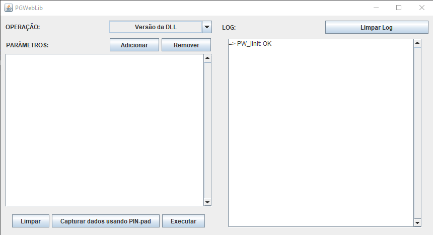

# PayGo Java
---
Exemplo de integração em Java com a biblioteca PGWebLib da plataforma de transações com cartão da PayGo Web.

## Ambiente e configuração da aplicação

Para o funcionamento da aplicação e correto reconhecimento da biblioteca de integração disponibilizada pela Pay&Go, algumas detalhes devem ser observados:
* JVM **32 bits**;
* Deve ser utilizado **Java 8**;
* O arquivo da *PGWebLib.dll* (incluso no repositório) deve ser incluído nua pasta mapeada no path do sistema. Preferencialmente na pasta SysWOW64 (*C:\Windows\SysWOW64*);
* A pasta do projeto deve possuir permissão de leitura e escrita;
* É necessário possuir um cadastro no ambiente de testes/sandbox da Pay&Go;
* PIN-pad com ponto de captura válido.

---

**Obs:** O projeto deve ser importado como *Maven Project* dentro da sua IDE de preferência.

----

Ao executar a aplicação, será utilizado o mesmo diretório do projeto para salvar os arquivos relativos à comunição da Automação com a infraestrutura da Pay&Go. Neste diretório serão criadas duas pastas:
* __Data:__ pasta utilizada pela lib para registrar arquivos internos.
* __Log:__ pasta onde ficam os arquivos de log da execução da aplicação e da comunicação com o PIN-pad.

## Execução

Para executar a aplicação é necessário, primeiramente, chamar o método **init()** da biblioteca e, em seguida, realizar a instalação do PIN-pad.
Neste exemplo foram implementadas duas formas de interação com a biblioteca PGWebLib: via **linha de comando** e via **interface gráfica**.

### Linha de comando
Crie uma instância da classe CMDInterface e realize a chamada aos métodos disponiblizados (listagem pode ser consultada na interface *UserInterface*).

### Interface gráfica
Na interface gráfica é possível selecionar a operação que se deseja realizar através do seletor na parte superior a esquerda.
Podem ser adicionados parâmetros a serem enviados na operação selecionado. Só é possível adicionar métodos que constem na documentação fornecida pela Pay&Go.
Além disso, a aplicação permite simular a solicitação de informações específicas do cliente através da opção **Capturar dados usando PIN-pad**.

---
## Gerando a aplicação java(.jar)

O arquivo JAR(Java ARchive) da aplicação PayGo Java contém todos os diretórios e classes compactadas em um único arquivo, facilitando a execução e distribuição da aplicação.
**Obs:** Lembrando que a aplicação PayGo Java é um *Maven Project*.
Exemplos de como gerar o .jar:

### Linha de comando
**Comando:** *mvn package*
Podemos verificar que o arquivo *paygo-java-1.0-SNAPSHOT.jar* foi criado no diretório *target* do projeto.
A aplicação pode ser executada com um duplo clique no .jar ou via linha de comando.
**Comando:** *java -jar paygo-java-1.0-SNAPSHOT.jar*

### IntelliJ IDEA
Pressione **Ctrl+Shift+A**, pesquise e selecione **Edit Configurations**. Irá aparecer uma nova tela **Run/Debug Configurations**, no canto superior esquerdo tem um **+**, clique nele e selecione *Maven*.
Repare que surgiu alguns campos para serem preenchidos:
* __Name:__ nome da nova configuração.
* __Working directory:__ caminho do projeto.
* __Command line:__ comando que queremos executar.

No campo *Command line* digite *package* e clique em **OK**. Pressione **Shift+F10** para executar a nova configuração.
Podemos verificar que o arquivo *paygo-java-1.0-SNAPSHOT.jar* foi criado no diretório *target* do projeto.

---
## Mais informações

- [Site Pay&Go](https://www.paygo.com.br)
- [dev@paygo.com.br](dev@paygo.com.br)
- 0800 737 2255 - opção 1